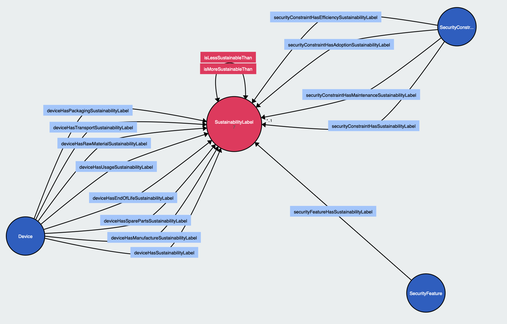

# EcoSec

## Introduction

EcoSec is a sustainability ontology designed to assess and label the sustainability impact of security mechanisms and devices throughout their lifecycle. It provides a framework for evaluating the environmental and operational sustainability of various elements.

## Purpose

EcoSec aims to systematically evaluate the sustainability of security mechanisms and devices, helping organizations make informed decisions that align with environmental and operational sustainability goals.

## Sustainability Labels
Classifies the sustainability performance of devices and security mechanisms from A (most sustainable) to G (least sustainable).

## Sustainability Requirements

Sustainability Requirements allow expressing sustainability-related expectations linked to existing security requirements.

A Security Requirement can be associated with one or more Security Features, which represent the security functionalities needed to satisfy that requirement.

Each Security Feature (inherited from OntoCarmen) includes the following properties:

- Security constraints.
- Security level.
- Sustainability label, added in EcoSec.

This sustainability label indicates the expected environmental and operational impact of the security functionality, independently of its specific implementation. In this way, security requirements can specify not only what security features are needed, but also the level of sustainability at which they should be implemented.

### Security Features 
Connects to a minimum sustainability label, indicating the acceptable level of sustainability for associated security mechanisms.

## Sustainability of Security Mechanisms

This section associates sustainability labels with security mechanisms. Each Security Constraint has four sustainability labels:
- General label: overall sustainability of the mechanism.
- Adoption: reflects how easily the mechanism can be adopted and integrated.
- Efficiency: measures operational and computational efficiency.
- Maintenance: assesses long-term maintenance effort and impact.

The three partial labels (Adoption, Efficiency, Maintenance) are used to calculate the general sustainability label using simple aggregation rules.

Additionally, EcoSec defines a set of individuals representing typical security mechanisms, each pre-labeled with a sustainability score and accompanied by an explanation of the reasoning.
This allows these mechanisms to be reused directly, providing a library of pre-evaluated, sustainability-aware security components for design and analysis.

### SecurityConstraint
Associates security mechanisms with their overall sustainability label based on adoption, maintenance, and efficiency.

Example

## Sustainability of Devices

This section evaluates the sustainability of devices by extending the existing Device class with sustainability-related properties.

Each device is associated with a general sustainability label, which is calculated from partial labels corresponding to its lifecycle stages. These partial labels reflect the environmental and operational impact of each stage, enabling a fine-grained assessment.

### Device Lifecycle
- **Raw Material**: Assesses material origin, extraction impacts, efficiency, recycled content, and hazardous substance compliance.
- **Manufacturing**: Evaluates CO2 emissions, water consumption, renewable energy usage, and waste treatment.
- **Packaging**: Focuses on material types, efficiency, and sustainability information.
- **Transport**: Assesses transport mode efficiency, logistics optimization, and transport packaging.
- **Usage**: Covers energy efficiency, durability, repairability, and software updates.
- **Spare Parts**: Evaluates availability, compatibility, and sustainability of spare parts.
- **End of Life**: Focuses on recyclability, return programs, and reusability.

